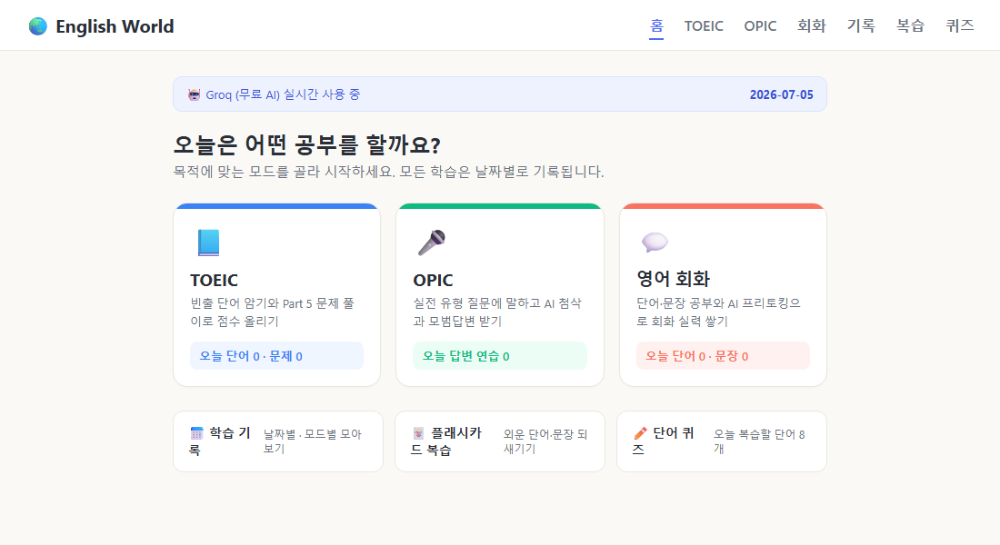
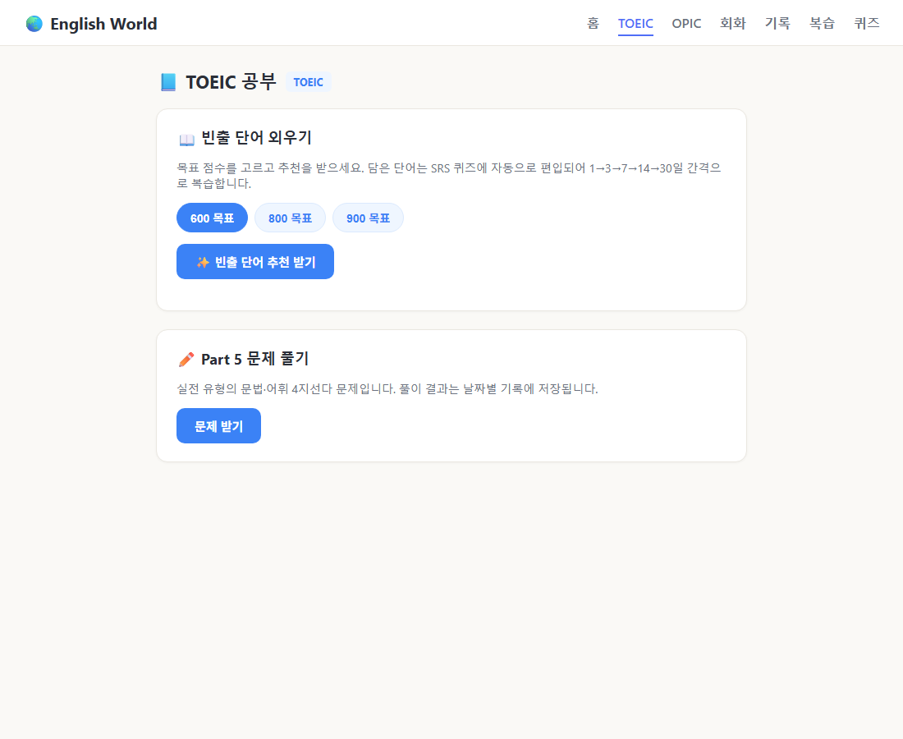
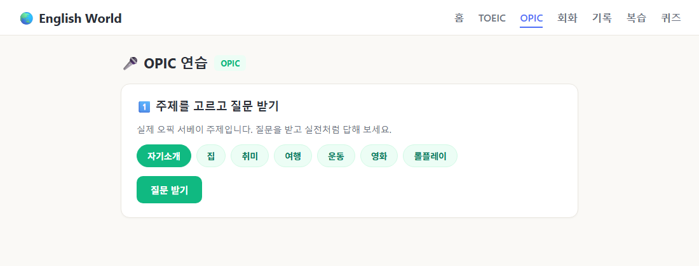
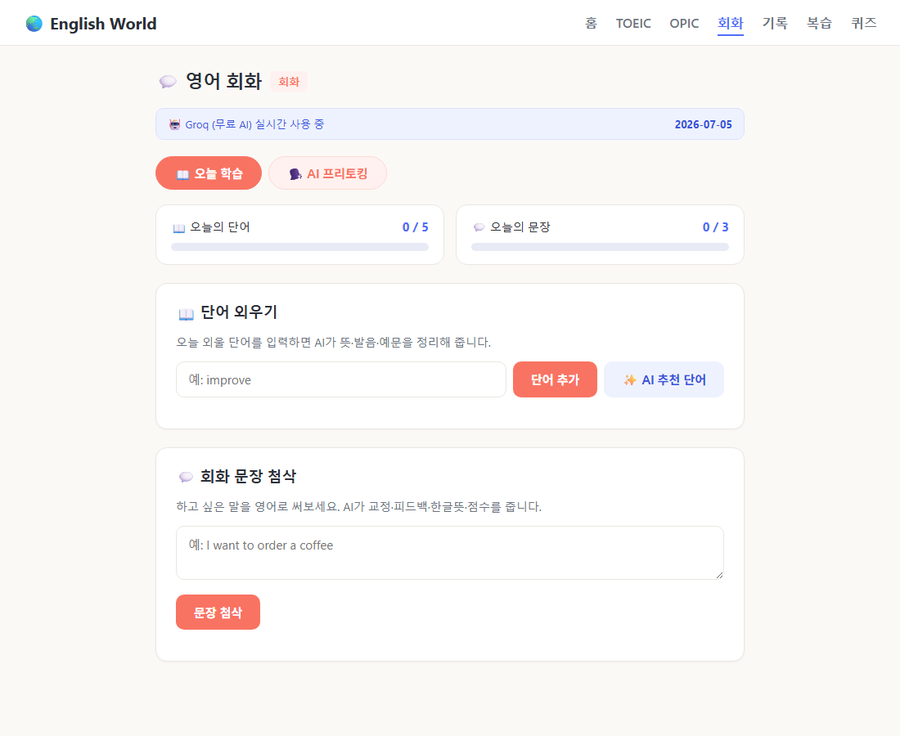
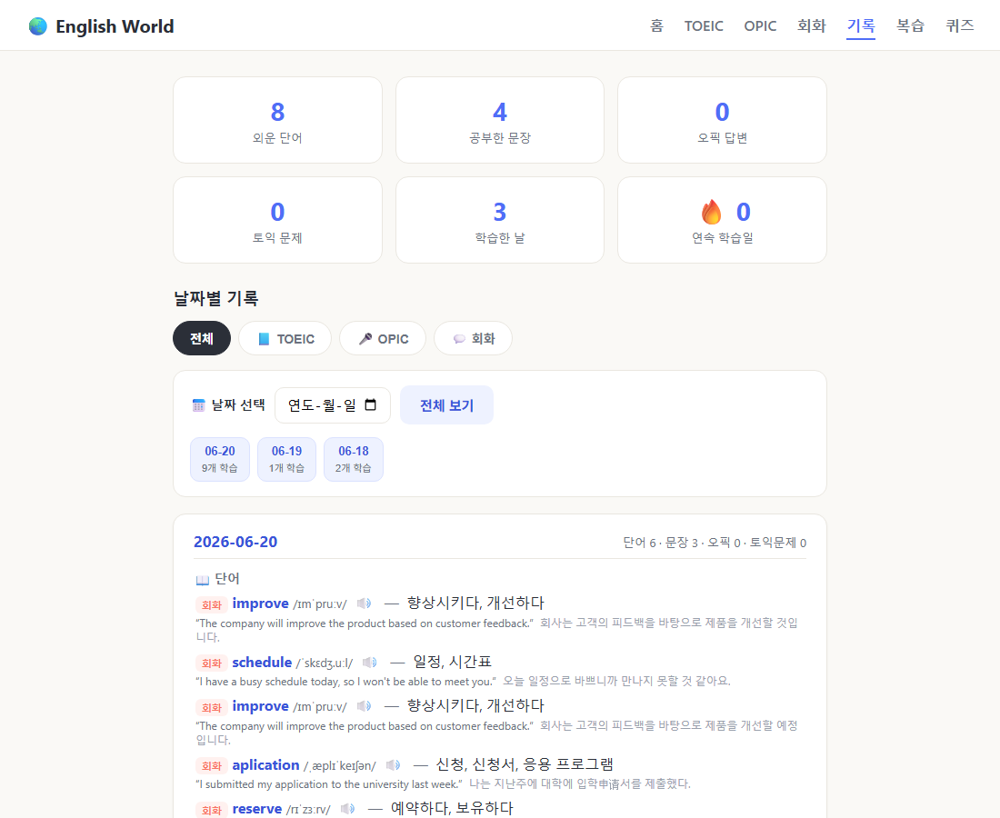
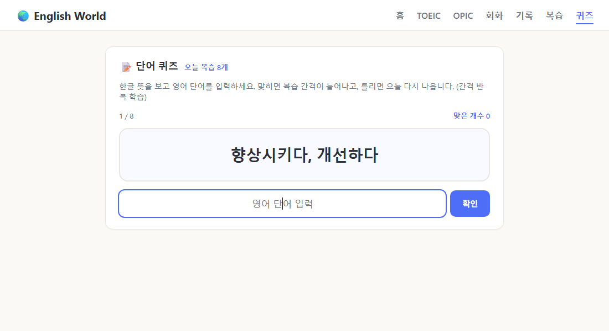

# 🌏 English World — AI 영어 학습 트래커

**TOEIC · OPIC · 영어 회화** — 학습 목적에 맞는 모드를 골라 공부하고,
**날짜별로 기록**하고, **간격 반복으로 복습**하는 개인 영어 학습 웹 프로그램입니다.

- **기간:** 2026.06 ~ 현재
- **역할:** 개인 프로젝트 (기획 · 개발 전부)
- **스택:** Python **Flask** · **OpenAI/Groq API** · **SQLite** · HTML/CSS/JS · Web Speech API

> 🔎 기술 선택 이유와 동작 원리는 [text.MD](text.MD)에 자세히 정리되어 있습니다.

---

## 📸 화면

**홈 — 학습 모드 선택** (TOEIC / OPIC / 회화 + 오늘 학습 요약)


| 📘 TOEIC (빈출 단어 + Part 5) | 🎤 OPIC (질문 → 말하기 → AI 첨삭) |
|---|---|
|  |  |

| 💬 회화 (오늘 학습 + AI 프리토킹) | 📅 학습 기록 (날짜별 · 모드별 필터) |
|---|---|
|  |  |

**단어 퀴즈** — 간격 반복(SRS)으로 모든 모드의 단어 통합 복습


---

## ✨ 주요 기능

### 0) 모드 선택 홈 (`/`)
- 첫 화면에서 **TOEIC / OPIC / 회화** 중 오늘 공부할 모드를 선택
- 모드별 오늘 학습량 요약 + 기록/복습/퀴즈 바로가기

### 1) 📘 TOEIC 모드 (`/toeic`)
- **빈출 단어** — 목표 점수(600/800/900)를 고르면 AI가 토익 빈출 단어 추천
  → 담으면 SRS 퀴즈에 자동 편입
- **Part 5 문제 풀기** — AI가 실전 유형 문법/어휘 4지선다 출제 → 채점 + 한국어 해설
  → 풀이 결과가 날짜별 기록에 저장

### 2) 🎤 OPIC 모드 (`/opic`)
- 서베이 주제(자기소개·집·취미·여행·롤플레이 등)별 **실전 유형 질문** 생성 + 음성 재생
- 답변은 **타이핑** 또는 **🎤 말하기**(브라우저 음성인식, 무료·키 불필요)
- AI가 **교정문 + 피드백 + 점수 + 모범답변** 제공, 날짜별 저장

### 3) 💬 회화 모드 (`/talk`)
- **단어 외우기** — 단어를 입력하면 AI가 **뜻·발음·예문·예문해석**을 정리해 저장
- **회화 문장 첨삭** — 영어 문장을 쓰면 AI가 **교정·피드백·한글뜻·점수(0~100)** 제공
- **AI 프리토킹** — 주제(카페·여행·면접·취미)를 골라 AI와 영어 대화,
  실수가 있으면 **📝 한국어 교정**을 덧붙여 줌

### 4) 학습 기록 (`/history`)
- **날짜별 + 모드별 필터** — 그날 외운 단어·문장·오픽 답변·토익 풀이를 한눈에
- 항목마다 모드 색상 뱃지 표시
- 통계: 단어 · 문장 · 오픽 답변 · 토익 문제 · 학습한 날 · **🔥 연속 학습일(streak)**

### 5) 복습 (`/review`) & 단어 퀴즈 (`/quiz`)
- **플래시카드** — 한글 뜻을 보고 영어를 떠올린 뒤 카드를 눌러 정답 확인
- **SRS 퀴즈** — 맞히면 복습 간격이 늘고(1→3→7→14→30일), 틀리면 오늘 다시 출제
  (Leitner 박스, 모든 모드의 단어 통합 관리)

### 🔊 발음 듣기 (전 화면)
- 단어·문장·정답·AI 답변 옆 🔊 버튼으로 원어민 발음 재생
- 브라우저 내장 음성합성 사용 → **무료·키 불필요**

> 💡 **AI 키가 없어도** 규칙기반 목업으로 동작합니다.
> **무료 Groq** 키를 넣으면 실제 AI로 자동 전환됩니다. → [무료AI설정.md](무료AI설정.md)

---

## 🚀 실행 방법

```bash
pip install -r requirements.txt    # 최초 1회
python app.py                      # 실행
```
→ 브라우저에서 **http://127.0.0.1:5000**

자세한 단계: [실행가이드.md](실행가이드.md)

---

## 🗂️ 프로젝트 구조

```
english world/
├─ app.py            # Flask 서버 (라우트 + API)
├─ db.py             # SQLite 저장/조회/통계/복습 (데이터 계층)
├─ ai_feedback.py    # AI 기능 (첨삭/단어/토익 문제/오픽 질문·첨삭) + 목업
├─ text.MD           # 📖 프로젝트 기술 설명 문서 (왜 이 기술을 썼는지)
├─ requirements.txt
├─ .env.example      # GROQ_API_KEY(무료) / OPENAI_API_KEY
├─ templates/        # home(모드선택) · toeic · opic · talk(회화) · history · review · quiz
├─ static/           # style.css + 페이지별 JS (toeic.js, opic.js, app.js, chat.js ...)
└─ tests/            # pytest (DB / API 검증)
```

### API

| 메서드 | 경로 | 설명 |
|--------|------|------|
| `POST` | `/api/word` | 단어 분석 + 저장 (`{word, mode}` 또는 추천 단어 객체) |
| `POST` | `/api/recommend-words` | `{topic}` → 추천 단어 목록 (저장 안 함) |
| `POST` | `/api/sentence` | `{sentence, mode}` → 교정/피드백/한글뜻/점수 + 저장 |
| `POST` | `/api/toeic/words` | `{level}` → 토익 빈출 단어 추천 (저장 안 함) |
| `POST` | `/api/toeic/question` | `{recent}` → Part 5 문제 (보기 4개 + 해설) |
| `POST` | `/api/toeic/answer` | 풀이 결과 저장 → `{is_correct}` |
| `POST` | `/api/opic/question` | `{topic}` → 오픽 질문 (영어 + 한국어 번역) |
| `POST` | `/api/opic/answer` | `{topic, question, answer}` → 첨삭/모범답변/점수 + 저장 |
| `GET`  | `/api/review?kind=words\|sentences` | 복습 카드 데이터 |
| `GET`  | `/api/quiz` | 오늘 복습할 단어(SRS) |
| `POST` | `/api/quiz/answer` | `{id, correct}` → 박스/다음 복습일 갱신 |
| `POST` | `/api/chat` | `{history, topic}` → AI 회화 응답 |

### DB 스키마

**words** — 외운 단어

| 컬럼 | 설명 |
|------|------|
| id, created_at, date | 식별/시각/날짜 |
| word, meaning, pronunciation | 단어, 한글뜻, 발음 |
| example, example_kr | 영어 예문, 예문 해석 |
| box, next_review | 간격 반복(SRS) 박스 단계 · 다음 복습일 |
| mode | 학습 모드 태그 (toeic/opic/talk) |

**sentences** — 공부한 회화 문장

| 컬럼 | 설명 |
|------|------|
| id, created_at, date | 식별/시각/날짜 |
| original, corrected | 내가 쓴 문장, AI 교정 |
| feedback, meaning, score | 피드백, 한글뜻, 점수 |
| mode | 학습 모드 태그 |

**opic_answers** — 오픽 답변 연습 (주제·질문·내답변·교정·피드백·모범답변·점수)

**toeic_quiz_log** — 토익 Part 5 풀이 기록 (문제·보기·내답·정답·해설·정오)

---

## 🛠️ 트러블슈팅 — "학습 기록이 가끔 사라지던 문제"

개발 초기에 학습 기록이 일부 사라지는 문제가 있었고, 저장 로직을 다음과 같이
바로잡아 해결했습니다. (관련 코드는 [`db.py`](db.py))

1. **커밋 누락** — `INSERT` 후 `commit()` 누락으로 데이터가 디스크에 남지 않던 문제
   → 저장을 컨텍스트 매니저로 감싸 **매번 commit / 실패 시 rollback** 보장
2. **저널 모드** — 쓰기 도중 중단 시 손상 위험 → **WAL + `synchronous=NORMAL`**
3. **에러를 조용히 삼키던 코드** → 저장 실패 시 **사용자에게 명확히 에러 반환**

---

## 📌 앞으로 개선하고 싶은 것
- 단어 퀴즈(객관식) 채점 모드
- 틀린 문법 유형별 통계
- 학습 알림 / 목표 달성 뱃지
