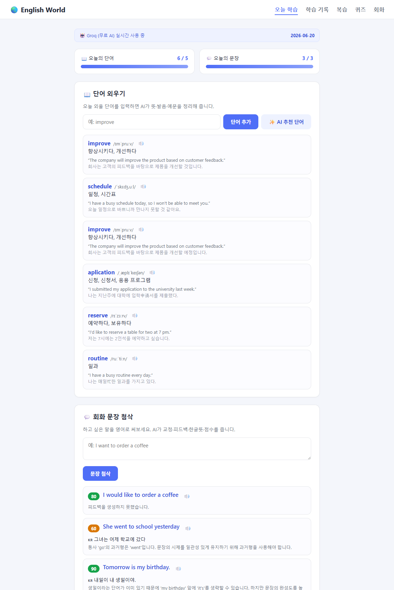
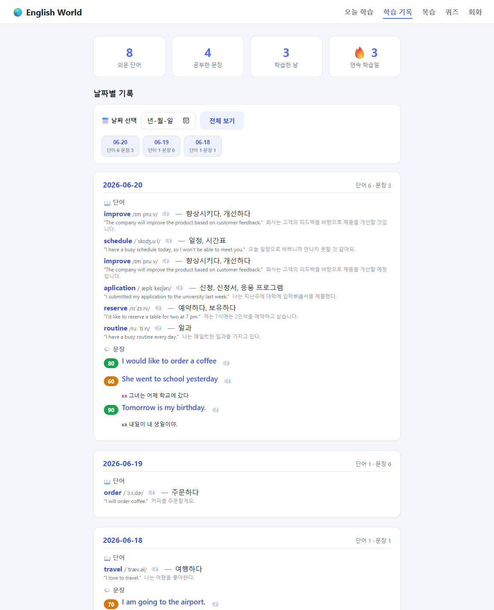
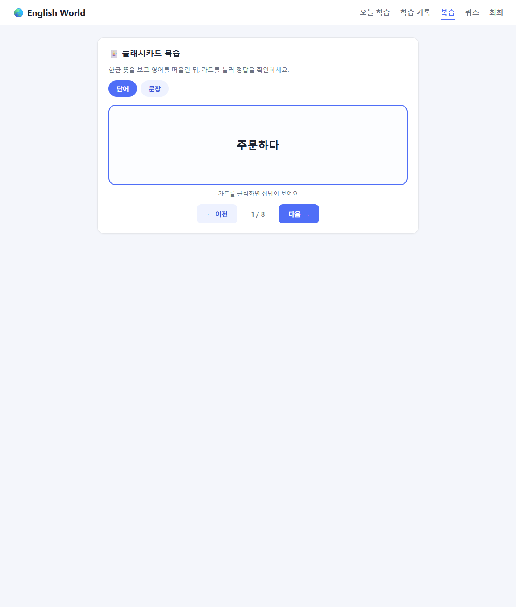
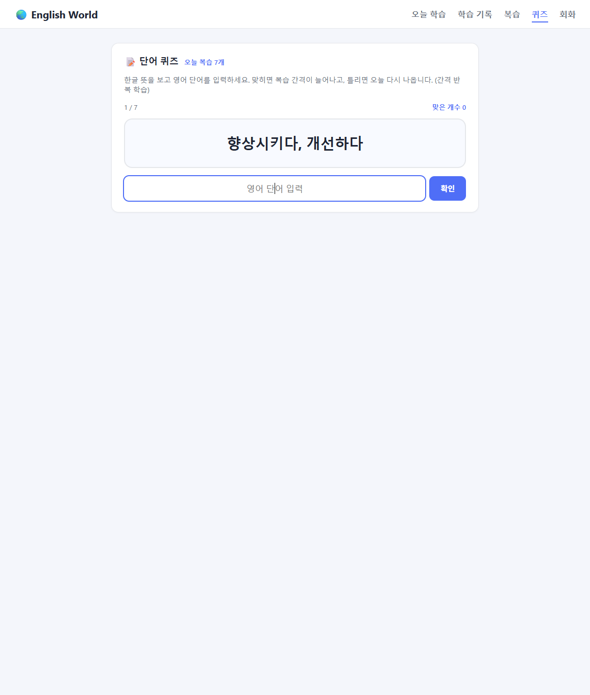
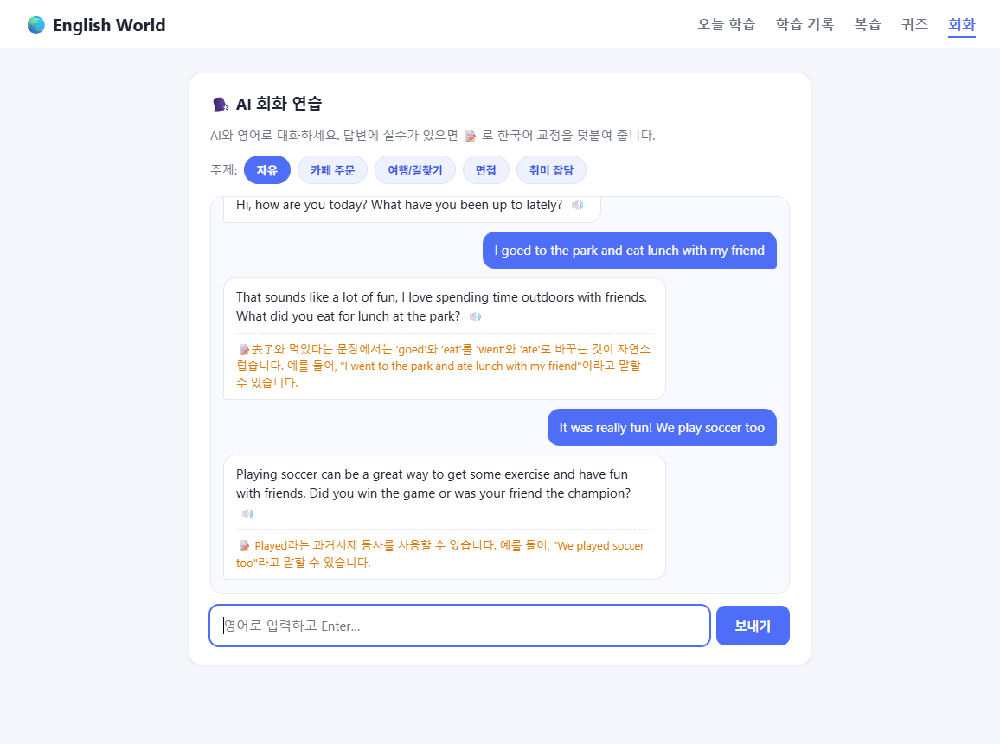

# 🌏 English World — AI 영어 학습 트래커

매일 **단어 5개 + 회화 문장 3개**를 공부하고, **날짜별로 기록**하고,
**플래시카드로 복습**하는 개인 영어 학습 웹 프로그램입니다.

- **기간:** 2026.06 ~ 현재
- **역할:** 개인 프로젝트 (기획 · 개발 전부)
- **스택:** Python **Flask** · **OpenAI/Groq API** · **SQLite** · HTML/CSS/JS

---

## 📸 화면

**오늘 학습** — 단어 5개 + 회화 문장 3개, AI 분석/첨삭, 진행도


| 학습 기록 (날짜별) | 복습 (플래시카드) |
|---|---|
|  |  |

| 단어 퀴즈 (간격 반복) | AI 회화 (한국어 교정) |
|---|---|
|  |  |

---

## ✨ 주요 기능

### 1) 오늘 학습 (`/`)
- **단어 외우기** — 단어를 입력하면 AI가 **뜻·발음·예문·예문해석**을 정리해 저장
  - **✨ AI 추천 단어** — 주제에 맞는 오늘의 단어를 AI가 추천 → 눌러서 담기
- **회화 문장 첨삭** — 영어 문장을 쓰면 AI가 **교정·피드백·한글뜻·점수(0~100)** 제공
- **오늘의 목표 진행도** — 단어 _/5, 문장 _/3 진행 바로 확인

### 2) 학습 기록 (`/history`)
- **날짜별**로 그날 외운 단어와 문장을 펼쳐서 한눈에 보기
- 통계: 외운 단어 수 · 공부한 문장 수 · 학습한 날 · **🔥 연속 학습일(streak)**

### 3) 복습 (`/review`)
- **플래시카드** — 한글 뜻을 보고 영어를 떠올린 뒤 카드를 눌러 정답 확인
- 단어 / 문장 탭 전환, 키보드(스페이스=뒤집기, ←→=이동) 지원

### 4) 단어 퀴즈 (`/quiz`) — 간격 반복(SRS)
- 한글 뜻을 보고 영어 단어를 입력 → 자동 채점
- **맞히면 복습 간격이 늘고(1→3→7→14→30일), 틀리면 오늘 다시** 출제 (Leitner 박스)
- 그날 복습할 단어만 모아 풀고, 점수 요약 제공

### 5) AI 회화 (`/chat`)
- 주제(카페·여행·면접·취미 등)를 골라 **AI와 영어로 대화**
- 내 답변에 실수가 있으면 **📝 한국어 교정**을 덧붙여 줌

### 🔊 발음 듣기 (전 화면)
- 단어·문장·정답·AI 답변 옆 🔊 버튼으로 원어민 발음 재생
- 브라우저 내장 음성합성 사용 → **무료·키 불필요**

> 💡 **AI 키가 없어도** 규칙기반 목업으로 동작합니다.
> **무료 Groq** 키를 넣으면 실제 AI로 자동 전환됩니다. → [무료AI설정.md](무료AI설정.md)

---

## 🚀 실행 방법

```bash
pip install -r requirements.txt    # 최초 1회
python app.py                      # 실행
```
→ 브라우저에서 **http://127.0.0.1:5000**

자세한 단계: [실행가이드.md](실행가이드.md)

---

## 🗂️ 프로젝트 구조

```
english world/
├─ app.py            # Flask 서버 (라우트 + API)
├─ db.py             # SQLite 저장/조회/통계/복습 (데이터 계층)
├─ ai_feedback.py    # AI 기능 (문장 첨삭 / 단어 분석 / 단어 추천) + 목업
├─ requirements.txt
├─ .env.example      # GROQ_API_KEY(무료) / OPENAI_API_KEY
├─ templates/        # index(오늘) · history(기록) · review(복습)
└─ static/           # style.css, app.js, review.js
```

### API

| 메서드 | 경로 | 설명 |
|--------|------|------|
| `POST` | `/api/word` | 단어 분석 + 저장 (`{word}` 또는 추천 단어 객체) |
| `POST` | `/api/recommend-words` | `{topic}` → 추천 단어 목록 (저장 안 함) |
| `POST` | `/api/sentence` | `{sentence}` → 교정/피드백/한글뜻/점수 + 저장 |
| `GET`  | `/api/review?kind=words\|sentences` | 복습 카드 데이터 |
| `GET`  | `/api/quiz` | 오늘 복습할 단어(SRS) |
| `POST` | `/api/quiz/answer` | `{id, correct}` → 박스/다음 복습일 갱신 |
| `POST` | `/api/chat` | `{history, topic}` → AI 회화 응답 |

### DB 스키마

**words** — 외운 단어

| 컬럼 | 설명 |
|------|------|
| id, created_at, date | 식별/시각/날짜 |
| word, meaning, pronunciation | 단어, 한글뜻, 발음 |
| example, example_kr | 영어 예문, 예문 해석 |
| box, next_review | 간격 반복(SRS) 박스 단계 · 다음 복습일 |

**sentences** — 공부한 회화 문장

| 컬럼 | 설명 |
|------|------|
| id, created_at, date | 식별/시각/날짜 |
| original, corrected | 내가 쓴 문장, AI 교정 |
| feedback, meaning, score | 피드백, 한글뜻, 점수 |

---

## 🛠️ 트러블슈팅 — "학습 기록이 가끔 사라지던 문제"

개발 초기에 학습 기록이 일부 사라지는 문제가 있었고, 저장 로직을 다음과 같이
바로잡아 해결했습니다. (관련 코드는 [`db.py`](db.py))

1. **커밋 누락** — `INSERT` 후 `commit()` 누락으로 데이터가 디스크에 남지 않던 문제
   → 저장을 컨텍스트 매니저로 감싸 **매번 commit / 실패 시 rollback** 보장
2. **저널 모드** — 쓰기 도중 중단 시 손상 위험 → **WAL + `synchronous=NORMAL`**
3. **에러를 조용히 삼키던 코드** → 저장 실패 시 **사용자에게 명확히 에러 반환**

---

## 📌 앞으로 개선하고 싶은 것
- 단어 퀴즈(객관식) 채점 모드
- 틀린 문법 유형별 통계
- 학습 알림 / 목표 달성 뱃지
